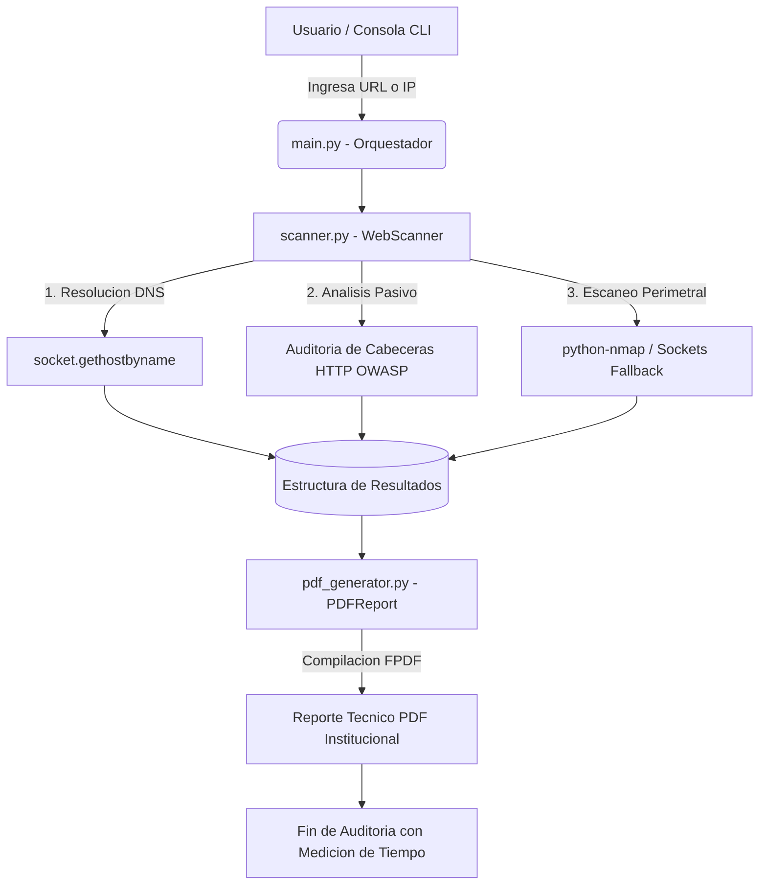

# IIAP Web Security Recon 🛡️🌲

**Herramienta automatizada para la estandarización del footprinting y generación de reportes técnicos de seguridad web en el Instituto de Investigaciones de la Amazonía Peruana (IIAP).**

---

## 📌 1. Descripción del Proyecto

El proyecto **`iiap-web-security-recon`** es una solución desarrollada en el marco de la investigación y fortalecimiento de la ciberseguridad institucional en el **IIAP**. Su propósito central es automatizar y estandarizar la fase inicial de reconocimiento pasivo (*footprinting*) de la superficie de ataque expuesta en las aplicaciones y portales web institucionales.

La herramienta evalúa la postura de seguridad perimetral y genera de forma automática un **informe técnico institucional en formato PDF** estructurado, facilitando la toma de decisiones ágil y la remediación de vulnerabilidades antes de que puedan ser aprovechadas por actores maliciosos.

### Objetivos Clave
- **Estandarización:** Unificar los criterios de auditoría técnica bajo directrices reconocidas internacionalmente (**OWASP Top 10** y **OWASP Secure Headers Project**).
- **Eficiencia y SLA:** Reducir los tiempos de recolección y reporte a menos de **5 minutos** (típicamente entre 5 y 15 segundos).
- **Generación Automática de Entregables:** Compilar métricas, tablas de puertos y matrices de cabeceras en un PDF maquetado con la identidad corporativa del IIAP.
- **Enfoque DevSecOps:** Integración nativa en pipelines de integración continua o tareas programadas de auditoría perimetral.

---

## 🏗️ 2. Arquitectura del Sistema

El proyecto sigue una arquitectura modular en Python desacoplada, separando la lógica de recolección de datos, el procesamiento/auditoría y la capa de presentación/reportes.

```
iiap-web-security-recon/
│
├── .gitignore          # Reglas de exclusión para Git (venv, bytecode, reportes PDF)
├── README.md           # Documentación completa y técnica del proyecto
├── requirements.txt    # Dependencias del ecosistema Python
├── main.py             # Orquestador y punto de entrada por consola (CLI)
├── scanner.py          # Motor de footprinting pasivo, DNS, cabeceras y nmap/sockets
├── pdf_generator.py    # Generador de reportes PDF técnicos con FPDF
└── assets/
    └── .gitkeep        # Directorio para recursos estáticos y logos institucionales
```

### Flujo de Ejecución



---

## 🔍 3. Módulos y Metodología de Auditoría

### 3.1. Reconocimiento de Red y DNS (`scanner.py`)
- Normalización automática de entradas (direcciones IP, nombres de dominio y URLs HTTP/HTTPS).
- Resolución directa de nombres de dominio hacia direcciones IPv4 para determinar el direccionamiento de los servidores del IIAP.

### 3.2. Evaluación Pasiva de Cabeceras HTTP (OWASP)
Se evalúan 6 directivas fundamentales de seguridad web:
1. **`X-Frame-Options`**: Previene ataques de *Clickjacking* en iframes.
2. **`Strict-Transport-Security` (HSTS)**: Obliga el uso estricto de cifrado HTTPS.
3. **`Content-Security-Policy` (CSP)**: Mitiga inyección de código y ataques Cross-Site Scripting (XSS).
4. **`X-Content-Type-Options`**: Evita la reinterpretación errónea de tipos MIME (`nosniff`).
5. **`Server`**: Identifica la exposición innecesaria de versiones del servidor web (Apache, Nginx, etc.).
6. **`X-Powered-By`**: Detecta divulgación de tecnologías del backend (PHP, Node.js, Express, ASP.NET).

### 3.3. Detección de Puertos y Banners de Servicios
- Audita los puertos comúnmente expuestos: **22 (SSH), 80 (HTTP), 443 (HTTPS), 8080 (HTTP Alternativo/Proxy)**.
- Utiliza **`python-nmap`** con detección de versiones ligeras (`-sV -T4 -Pn`).
- Incorpora un **mecanismo de fallback basado en sockets TCP**: si el binario de Nmap no se encuentra en el `PATH` del sistema, la herramienta continúa operando sin interrupción realizando pruebas pasivas de conexión e inspección de banners HTTP/SSH.

### 3.4. Motor de Reportes PDF (`pdf_generator.py`)
- Construido con la librería **FPDF**.
- Encabezado con membrete institucional del **Instituto de Investigaciones de la Amazonía Peruana**.
- Tabla estructurada de puertos, protocolos, estados y banners.
- Matriz de cabeceras HTTP con clasificación por nivel de riesgo (Bajo, Medio, Alto, Seguro).
- Sección de acciones correctivas y buenas prácticas DevSecOps.

---

## ⚙️ 4. Requisitos Previos

1. **Python 3.8 o superior** instalado en el sistema.
2. *(Opcional pero recomendado)* **Nmap** instalado en el sistema operativo y agregado a las variables de entorno (`PATH`). Si no está disponible, el script activará el modo socket fallback automáticamente.

---

## 🚀 5. Instalación y Configuración

### Paso 1: Clonar el Repositorio
```bash
git clone https://github.com/nunez-vicerra-andrea/iiap-web-security-recon.git
cd iiap-web-security-recon
```

### Paso 2: Crear y Activar un Entorno Virtual
En Windows (PowerShell):
```powershell
python -m venv .venv
.\.venv\Scripts\Activate.ps1
```

En Linux / macOS:
```bash
python3 -m venv .venv
source .venv/bin/activate
```

### Paso 3: Instalar Dependencias
```bash
pip install -r requirements.txt
```

---

## 💻 6. Modo de Uso

### Ejecución Interactiva (Recomendada)
Ejecute el script principal directamente. El programa solicitará el objetivo:
```bash
python main.py
```
**Ejemplo de interacción:**
```text
 ========================================================================
   IIAP WEB SECURITY RECON - FOOTPRINTING & AUDITORIA TECNICA
   Instituto de Investigaciones de la Amazonia Peruana (IIAP)
   Area de Ciberseguridad & DevSecOps
 ========================================================================

 [?] Ingrese la URL o IP del objetivo (ej. iiap.gob.pe): iiap.gob.pe

 [*] Iniciando auditoria para: iiap.gob.pe
 [*] [1/4] Inicializando motor de reconocimiento...
 [*] [2/4] Resolviendo DNS y geolocalizacion logica...
     [+] Hostname: iiap.gob.pe -> IP: 200.60.103.138
 [*] [3/4] Evaluando cabeceras HTTP de seguridad (OWASP)...
     [+] Se evaluaron 6 directivas de seguridad.
 [*] [4/4] Escaneando puertos principales (22, 80, 443, 8080)...
     [!] Puertos abiertos detectados: [80, 443]

 [*] Consolidando datos y generando reporte tecnico institucional...
     [+] Reporte generado exitosamente: C:\Documentos\iiap-web-security-recon\reporte_recon_iiap.gob.pe_20261009_110625.pdf

 ========================================================================
  [>] Auditoria completada en: 00m 08.45s (8.45 s)
  [>] Motor utilizado: Python Socket Engine (Nmap CLI no disponible)
  [>] Cumplimiento de SLA: APROBADO (< 5 min)
 ========================================================================
```

### Ejecución por Línea de Comandos (Automatización DevSecOps)
Puede pasar el objetivo y una ruta de salida personalizada mediante flags:
```bash
python main.py -t iiap.gob.pe -o reporte_auditoria_iiap.pdf
```

---

## 🛡️ 7. Consideraciones Éticas y de Seguridad

Esta herramienta ha sido concebida con propósitos estrictamente **defensivos, académicos y de auditoría de seguridad autorizada** para los activos digitales del IIAP.
- El escaneo realiza únicamente consultas pasivas y revisiones de puertos convencionales sin inyectar cargas útiles (payloads) ni realizar pruebas intrusivas.
- Todo análisis sobre sistemas informáticos debe contar con la debida autorización de los administradores de red del IIAP.

---

## 📄 Licencia

Este proyecto está bajo la licencia [MIT](LICENSE) - Desarrollado para la investigación y fortalecimiento de la ciberseguridad en el Instituto de Investigaciones de la Amazonía Peruana.
