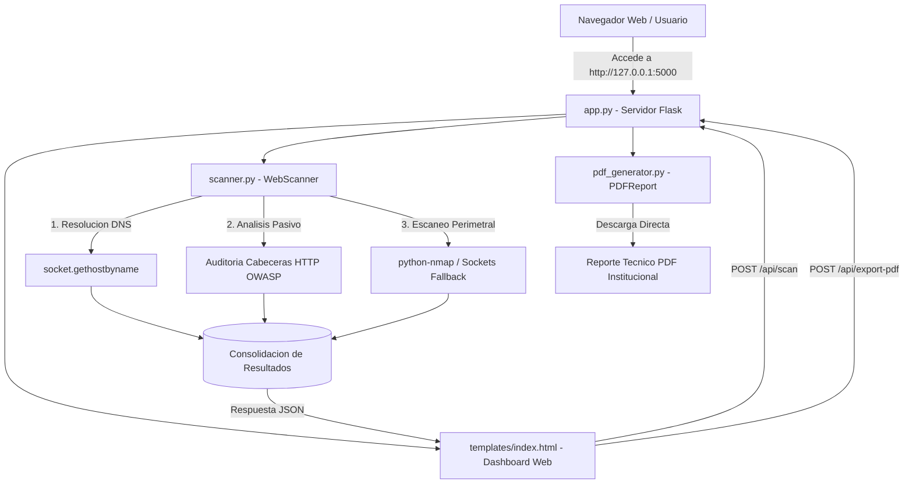

# IIAP Web Security Recon

**Herramienta interactiva y automatizada para la estandarización del footprinting y generación de reportes técnicos de seguridad web en el Instituto de Investigaciones de la Amazonía Peruana (IIAP).**

---

## 📌 1. Descripción del Proyecto

El proyecto **`iiap-web-security-recon`** es una plataforma desarrollada en el marco de la investigación y fortalecimiento de la ciberseguridad institucional en el **IIAP**. Proporciona una interfaz web moderna y automatizada (Dashboard Localhost en Flask) y una interfaz de consola (CLI) para realizar el reconocimiento pasivo (*footprinting*) de la superficie de ataque perimetral de portales y servicios web institucionales.

La herramienta evalúa la postura de seguridad perimetral, visualiza los hallazgos en tiempo real a través de tarjetas y tablas interactivas, y permite exportar un **informe técnico institucional en formato PDF** estructurado y oficial con membrete del IIAP.

### Objetivos Clave
- **Estandarización:** Unificar los criterios de auditoría técnica bajo directrices reconocidas internacionalmente (**OWASP Top 10** y **OWASP Secure Headers Project**).
- **Eficiencia y SLA:** Reducir los tiempos de recolección y reporte a menos de **5 minutos** (típicamente entre 5 y 15 segundos).
- **Dashboard Web Moderno:** Interfaz gráfica interactiva inspirada en consolas de ciberseguridad (SOC / OWASP ZAP) desarrollada con Flask.
- **Generación Automática de Entregables:** Compilar métricas, tablas de puertos y matrices de cabeceras en un PDF maquetado con la identidad corporativa del IIAP.
- **Enfoque DevSecOps:** Endpoint API RESTful para integración en pipelines de CI/CD o auditorías periódicas automatizadas.

---

## 🏗️ 2. Arquitectura del Sistema

El proyecto sigue una arquitectura desacoplada y modular en Python:

```
iiap-web-security-recon/
│
├── .gitignore          # Reglas de exclusión para Git (venv, bytecode, reportes PDF)
├── README.md           # Documentación técnica completa
├── requirements.txt    # Dependencias del proyecto (Flask, Requests, Nmap, FPDF)
├── app.py              # Servidor Web Flask (Dashboard Localhost y API REST)
├── main.py             # Orquestador CLI por consola y lanzador alternativo
├── scanner.py          # Motor de footprinting pasivo, DNS, cabeceras y nmap/sockets
├── pdf_generator.py    # Generador de reportes PDF institucionales con FPDF
├── templates/
│   └── index.html      # Dashboard Web interactivo de ciberseguridad
└── assets/
    └── .gitkeep        # Directorio para recursos estáticos y logos institucionales
```

### Flujo de Funcionamiento



---

## 🔍 3. Módulos y Metodología de Auditoría

### 3.1. Reconocimiento de Red y DNS (`scanner.py`)
- Normalización automática de entradas (direcciones IP, nombres de dominio y URLs HTTP/HTTPS).
- Resolución directa de nombres de dominio hacia direcciones IPv4 para determinar el direccionamiento de los servidores del IIAP.

### 3.2. Evaluación Pasiva de Cabeceras HTTP (OWASP)
Se evalúan 6 directivas fundamentales de seguridad web:
1. **`X-Frame-Options`**: Previene ataques de *Clickjacking* en iframes.
2. **`Strict-Transport-Security` (HSTS)**: Obliga el uso estricto de cifrado HTTPS.
3. **`Content-Security-Policy` (CSP)**: Mitiga inyección de código y ataques Cross-Site Scripting (XSS).
4. **`X-Content-Type-Options`**: Evita la reinterpretación errónea de tipos MIME (`nosniff`).
5. **`Server`**: Identifica la exposición innecesaria de versiones del servidor web (Apache, Nginx, etc.).
6. **`X-Powered-By`**: Detecta divulgación de tecnologías del backend (PHP, Node.js, Express, ASP.NET).

### 3.3. Detección de Puertos y Banners de Servicios
- Audita los puertos comúnmente expuestos: **22 (SSH), 80 (HTTP), 443 (HTTPS), 8080 (HTTP Alternativo/Proxy)**.
- Utiliza **`python-nmap`** con detección de versiones ligeras (`-sV -T4 -Pn`).
- Incorpora un **mecanismo de fallback basado en sockets TCP**: si el binario de Nmap no se encuentra en el `PATH` del sistema, la herramienta continúa operando sin interrupción realizando pruebas pasivas de conexión e inspección de banners HTTP/SSH.

### 3.4. Motor de Reportes PDF (`pdf_generator.py`)
- Construido con la librería **FPDF**.
- Encabezado con membrete institucional del **Instituto de Investigaciones de la Amazonía Peruana**.
- Tabla estructurada de puertos, protocolos, estados y banners.
- Matriz de cabeceras HTTP con clasificación por nivel de riesgo (Bajo, Medio, Alto, Seguro).
- Sección de acciones correctivas y buenas prácticas DevSecOps.

---

## 🌐 4. Endpoints de la API REST (`app.py`)

| Método | Endpoint | Descripción |
| :--- | :--- | :--- |
| `GET` | `/` | Carga el Dashboard Web interactivo en el navegador. |
| `GET` | `/api/health` | Verifica la disponibilidad y estado del servicio. |
| `POST` | `/api/scan` | Procesa un objetivo (`{"target": "iiap.gob.pe"}`) y retorna las métricas en JSON. |
| `POST` | `/api/export-pdf` | Compila y descarga el reporte oficial institucional en formato PDF. |

---

## ⚙️ 5. Requisitos Previos e Instalación

### 1. Clonar el Repositorio
```bash
git clone https://github.com/nunez-vicerra-andrea/iiap-web-security-recon.git
cd iiap-web-security-recon
```

### 2. Crear y Activar un Entorno Virtual
En Windows (PowerShell):
```powershell
py -m venv .venv
.\.venv\Scripts\Activate.ps1
```

En Linux / macOS:
```bash
python3 -m venv .venv
source .venv/bin/activate
```

### 3. Instalar Dependencias
```bash
py -m pip install -r requirements.txt
```

---

## 💻 6. Guía de Ejecución

### Opción A: Iniciar el Dashboard Web Interactivo (Recomendado)

Inicie el servidor web de Flask ejecutando:
```bash
py app.py
```
*(O de manera alternativa: `py main.py --web`)*

Una vez iniciado, abra su navegador web e ingrese a:
👉 **[http://127.0.0.1:5000](http://127.0.0.1:5000)**

#### Características del Dashboard:
- **Formulario de Objetivo:** Ingrese el dominio o IP, o seleccione accesos directos preconfigurados del IIAP.
- **Tarjetas KPI:** Muestra en tiempo real la IP resuelta, cantidad de puertos abiertos, cabeceras seguras y tiempo de escaneo.
- **Pestaña Cabeceras HTTP:** Matriz interactiva de seguridad con semáforo de colores según criticidad y recomendaciones OWASP.
- **Pestaña Puertos Nmap:** Tabla dinámica con puertos 22, 80, 443, 8080 y banners de servicios.
- **Exportación con un Clic:** Botón "Exportar a PDF" que descarga directamente el informe técnico oficial.

---

### Opción B: Ejecución por Consola (Modo CLI)

Para entornos sin entorno gráfico o scripts de terminal:
```bash
py main.py
```
O especificando parámetros directamente:
```bash
py main.py -t iiap.gob.pe -o reporte_auditoria.pdf
```

---

## 🛡️ 7. Consideraciones Éticas y de Seguridad

Esta herramienta ha sido concebida con propósitos estrictamente **defensivos, académicos y de auditoría de seguridad autorizada** para los activos digitales del IIAP.
- El escaneo realiza únicamente consultas pasivas y revisiones de puertos convencionales sin inyectar cargas útiles (payloads) ni realizar pruebas intrusivas.
- Todo análisis sobre sistemas informáticos debe contar con la debida autorización de los administradores de red del IIAP.

---

## 📄 Licencia

Este proyecto está bajo la licencia [MIT](LICENSE) - Desarrollado para la investigación y fortalecimiento de la ciberseguridad en el Instituto de Investigaciones de la Amazonía Peruana.
